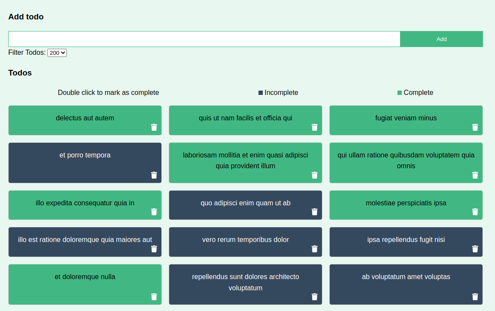

# Vuex Todo Manager

This repository comes from a small video-course about VueJS 2 and Vuex.

Course: https://www.youtube.com/watch?v=5lVQgZzLMHc

App: https://mexidense.github.io/vuex-todo-manager/

